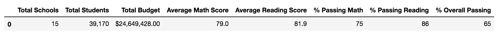
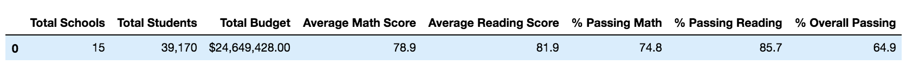
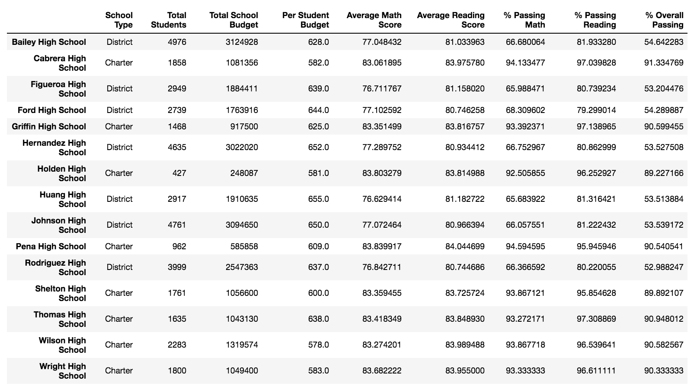
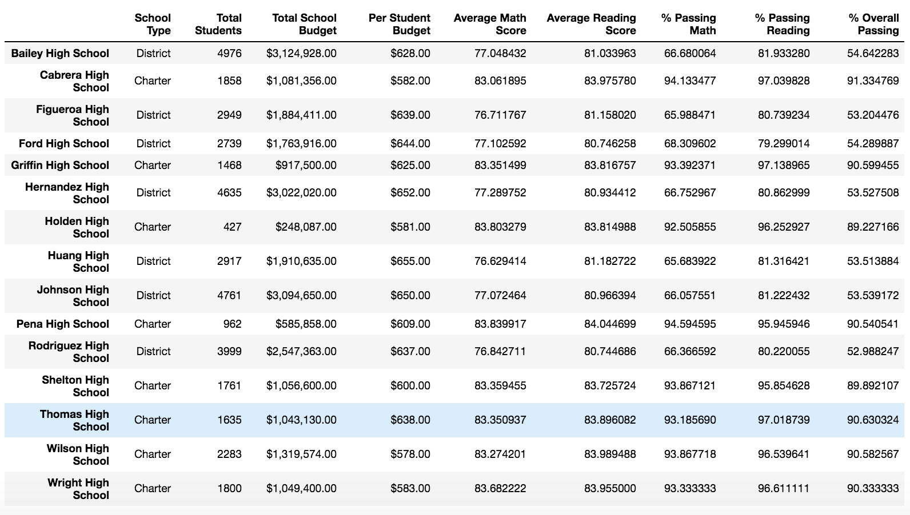
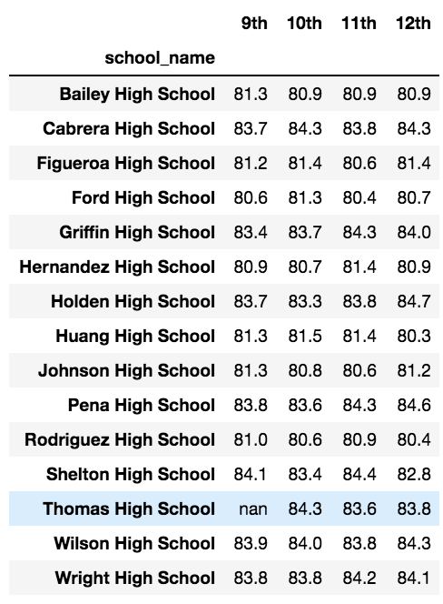
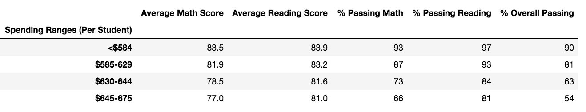
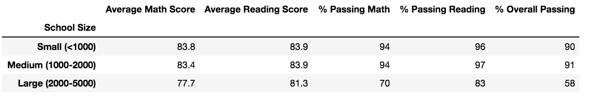
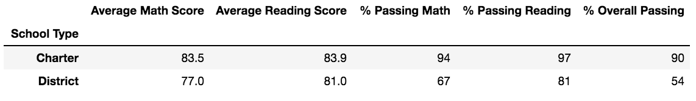

# School District Analysis

## Overview
In this analysis, we are helping our colleague, Maria, with analyzing the standardized testing and school funding data in the school district to present to the school board to help them make decisions for the school budget and assess priorities. After providing the school board with a high-level snapshot of the district's key metrics per school, the board finds out that the students_complete.csv file shows evidence of academic dishonesty; specifically, the reading and math grades for Thomas High School ninth graders appear to have been altered. Even though the board has yet to find out the extent the academic dishonesty, they ask us to replace the reading and math scores for Thomas High School with “NaNs” or "Not-a-Number" value, for the 461 students while keeping the rest of the data intact. Although this may seem like a significant number, these score replacements did not alter data summaries tremendously overall.

## Results

# How is the School District Summary affected?
School District Summary

School District Summary without Thomas High School Scores

When analyzing the average scores and passing percentages among the 15 high schools in the district, our figures have not significantly changed. The average math score dropped by .1 and there is a 1% drop in the “percent passing math”, “percent passing reading”, and “overall passing percentage”. 

# How is the School Summary affected?
School Summary Summary

School District Summary without Thomas High School Scores

When comparing school summaries, again we don’t see much of a difference. Thomas High School’s performance relative to the other schools after replacing the ninth graders’ math and reading scores is within the same standing as it was with the falsified scores. We see a similar change as we did with the district summary, where our numbers drop by .1%. Since we simply did not count the ninth grade math and reading scores, so the data only shows the scores from grades 10-12, who scored relatively well as shown in the next section.

# How does replacing the ninth-grade scores affect the following:

* Math and Reading Scores by Grade

Math Scores by Grade

Reading Scores by Grade

If we take a look deeper within the data, looking at how Thomas High School’s performance relative to the other schools after replacing the ninth graders’ math and reading scores per grade, we slight change. Granted, both the average math and reading score summaries are stratified by school and grade level. As shown above, the summary tables display "NaN" for ninth grade at Thomas High School whereas the remaining data remained intact. 

* Scores by School Spending

Reviewing the school spending summary, we notice there is about 7% fall in the percentage for the math, reading and overall in the spending range $630-644 because the per student budget of Thomas High School ($638) comes in this range.

 * Scores by school size

Based on the school size there is no difference on the average math and reading scores. But there is about 6% fall in the percentage for the math, reading and overall as compared to the previous dataframe for medium (1000-2000 students) size schools. This is due to the fact that the Thomas High School has 1635 students which comes in the category of medium size schools.

 * Scores by school type

There is no change in the average math and reading scores based on the school type. Although, since Thomas High School is charter type school, there is a reduction of 4% in the math and reading passing percentage. The overall percentage falls by 3 % from the previus. 

## Summary

The tampering of Thomas High School ninth grade data overall did not have a major impact on the school district's metrics, since they were not included. The data overall suggest that smaller to more medium sized schools have the greatest chance to be successful. 

